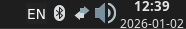

# PSA Keyboard Switcher

A system tray application that displays and manages keyboard layout indicators for X11 systems. This tool provides a visual indicator in the system tray that updates automatically when you switch between different keyboard layouts.

## Features

- System tray icon that shows current keyboard layout
- Automatic layout detection and switching
- Customizable font support
- Support for multiple keyboard layouts (Russian, English, Ukrainian, etc.)
- Real-time updates when switching layouts

## Dependencies

- Rust 2021 edition
- x11rb (with XKB feature enabled)
- image crate
- ab_glyph for text rendering

## Installation

1. Ensure you have Rust installed on your system
2. Clone the repository
3. Build the project: `cargo build --release`
4. Run the application: `cargo run`

## Configuration

The application uses a default font path (`/usr/share/fonts/TTF/DejaVuSans.ttf`). You can modify this in the source code if needed.

## How It Works

The application connects to the X11 server, enables XKB extension for keyboard handling, detects available keyboard layouts, creates a system tray icon, and updates the icon based on the current keyboard layout.

## Example

The above image shows how the tray icon appears in the system tray with different keyboard layout indicators.

## License

This project is licensed under the MIT License.